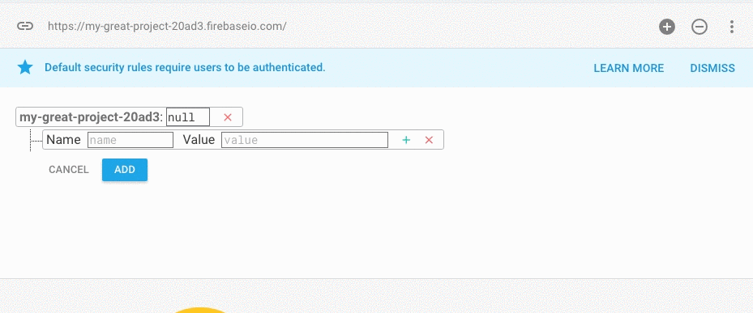
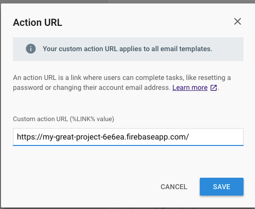

# Firebase auth starter
Contains the necessary base html and javascript for confirm email and reset password in firebase projects.

## Step 1 - Create a fresh copy of this repo
``git clone https://git.solidstategroup.com/kyle/firebase-project-starter.git && cd ./firebase-project-starter/ && rm -rf .git && git init``

## Step 2 - Create a new firebase project
https://console.firebase.google.com/

## Step 3 - Add a profiles object to your database

## Step 4 - Deploy this project to firebase
Go to Hosting > Get started > Follow the instructions for hosting

**Select all defaults, make sure you select no when asked if you wish to overwrite index.html**

## Step 5 - Set the email template action url, enable signin providers you wish to use

## Step 6 - Use fireauth with project config
For an example see https://git.solidstategroup.com/solidstategroup/ssg-frontend-boilerplate